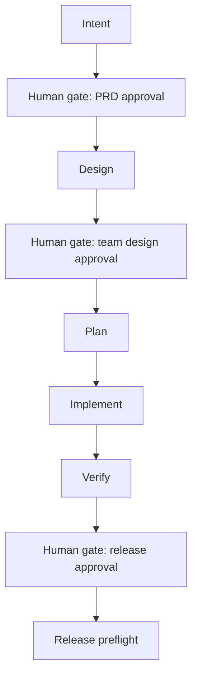

# skill-commons

[](https://github.com/Chuliying/skill-commons/actions/workflows/ci.yml)

**skill-commons 讓 AI agent 的開發產出可重複、可審查、可延續。** 它把軟體交付流程的形狀固定下來：需求、規格、計畫、實作、驗證、發布每一步都產出形體一致、可續跑、可被 script 驗證的 artifact，換 session、換模型、換 agent 都接得回來——直接解決 agent 開發最痛的三件事：產出形體不一致、「完成」沒有證據、換一次對話就斷。它是一套可同步到 Claude Code、Codex 與 Cursor 的工程工作流程技能集，v0.6.0 是公開 beta，自動化驗證涵蓋 Python CLI 與 TypeScript/Web fixtures。

此 repo 適合需要把 agent 工作落到可追蹤 artifact 的個人開發者與團隊。技能本體以 zh-TW 維護；非中文讀者可先看 [English summary](README.en.md)。

## 設計意圖

一句話：把開發流程的形狀固定下來，讓每次產出形體一致、可續、可被 script 驗證。三組原則約束它的行為：

- **落檔與證據。** LLM context 是揮發性的，持久狀態落在 `docs/work/<slug>/`、`meta.yml` 與 plan-sync 外部記憶，換 session 可續；LLM 會在沒有證據時宣稱成功，所以各 Gate 與 verification-before-completion 要求直接證據，不接受「應該沒問題」。
- **安全與分工。** 不可逆操作（push、merge、刪除）先套用 guardrails，由 sync-work 與 Recovery Mode 控制邊界；人工審查應集中在判斷（需求、設計取捨、發布或合併），機械檢查交給 script。
- **合身不過度。** 交接才需要契約（team profile 產正式 PRD、Spec、QA；personal 用快照與輕量 plan）；Gate 密度由 min(重做成本, 操作者的錯誤定位能力) 決定，工程流程自動化可機械判斷的項目。

## Architecture overview



Top-level 技能資料夾是唯一 source of truth。`bootstrap/generate.sh` 依 profile fan-out 到 Claude Code、Codex 與 generic agent skill roots；Cursor 透過 always-on rule 載入同一份 router 指令。Consuming repo 的 `.agent/project-manifest.md` 提供 paths、stack、Git workflow 與 domain skill 名單；shared skills 讀取 manifest，不寫死專案細節。

## Profiles

| Profile | 技能數 | 適用情境 | Pipeline |
|---|:---:|---|---|
| core | 14 | 兩種使用情境共用的正確性、安全、Git 與外部記憶能力 | 基礎層 |
| team-sprint | 19 | 多人團隊，需要正式交接契約 | core + 5 team skills |
| personal | 16 | 個人專案，降低文件與人工 Gate 密度 | core + 2 personal skills |
| optional | 4 | 文件轉換、codebase 理解、多 agent 執行、文字風格修訂 | 按任務安裝 |

Manifest bootstrap 區塊用 `profile: team-sprint` 或 `profile: personal` 選擇 workflow bundle；需要 utilities 時可組合成 `profile: personal optional` 或 `profile: team-sprint optional`。留空會 fan-out 25 個 workflow skills。`skill-creator` 是 top-level 維護者工具，不進 consuming profiles。

## 前置需求

- git（需支援 submodule）。
- bash 4+。
- `jq`（合併 Claude Code settings 時使用）。
- Node.js 18+（執行 onboarding scan 與維護本 repo 的 fixture 驗證時使用）。
- Python 3.10+（消費端選用；執行 plan-sync scripts 或 markitdown 時需要；維護本 repo、跑完整 Verify 時必需）。

## Quick Start

```bash
# 1. 掛載 skill-commons
git submodule add git@github.com:Chuliying/skill-commons.git .agent/skills/_shared

# 2. 建議使用 tag pin，避免 upstream main 變動直接改變 workflow
git -C .agent/skills/_shared checkout v0.6.0

# 3. 建立最小 manifest/guardrails、平台 shim，並 fan-out 可觸發的 skills
bash .agent/skills/_shared/bootstrap/onboard.sh
```

接著把這段交給 agent：

```text
先不要開始開發。讀取 `.agent/skills/_shared/shared-skill-onboarder/SKILL.md`，
以 Scan 模式補齊 project manifest，回報無法由 repo 證據確認的欄位。
```

更新 submodule 時先 checkout 已審核的 tag，再重跑 `onboard.sh`。

### Troubleshooting

- **submodule 失敗**：確認 SSH 權限與 repo URL，再跑 `git submodule update --init --recursive`。
- **找不到 `jq`**：安裝 `jq` 後重跑 `onboard.sh`；script 不會自行修改系統套件。
- **onboard 後 router 報缺檔**：確認 `.agent/project-manifest.md` 與 `.agent/guardrails.md` 是可讀檔案，再重跑 onboarder 的 Scan 模式。

## Gate 是什麼

Gate 是階段交接前的判斷點。證據不足時停止，不以進度百分比代替驗收。

- **人工 Gate**：PRD 核可、team 設計核可、發布核可。這些項目需要產品或工程判斷。
- **機器 Gate**：結構、traceability、typecheck、lint、test、secret preflight。這些項目由 script 產生 PASS、FAIL 或 N/A 證據。

Profile 控制文件密度；capability 控制哪些機器 Gate 適用。完整定義見各 skill 的 `SKILL.md`。

## 常用觸發速查

| 你想做什麼 | Skill | 觸發方式 |
|---|---|---|
| 需求仍模糊 | brainstorming | `/brainstorming` |
| 需求轉 PRD | to-prd、prd-interview | `/to-prd`、`/prd-interview` |
| PRD 轉技術規格 | spec | `/spec` |
| 規劃與外部記憶 | plan-sync | `/plan-sync` |
| 寫功能或修 bug | implement | `/implement` |
| 測試方案與驗收 | qa | `/qa plan`、`/qa validate` |
| 完成前驗證 | verification-before-completion | 自動觸發 |
| Code review | caveman-review | `/caveman-review` |
| 文字風格修訂 | humanizer | `/humanizer`、`humanize this text` |
| commit 或 push | sync-work | `/sync-work` |
| 接入新專案 | shared-skill-onboarder | `/shared-skill-onboarder` |

完整技能索引與 flow 導航見 [INDEX.md](INDEX.md) 與 [skill-router/SKILL.md](skill-router/SKILL.md)。

## 維護與貢獻

Fan-out、provenance、技能生命週期、版本與驗證規則集中在 [CONTRIBUTING.md](CONTRIBUTING.md)。修改 top-level 技能後必須重新 generate 並跑完整 Verify。

## 文件連結

- [English summary](README.en.md)
- [CONTRIBUTING.md](CONTRIBUTING.md) — 維護流程與技能生命週期
- [CHANGELOG.md](CHANGELOG.md) — 使用者可感知的版本變更
- [INDEX.md](INDEX.md) — 技能索引與 profiles
- [STYLE.md](STYLE.md) — 產文風格規範
- [SOURCES.md](SOURCES.md) — 外部來源、授權與本地 patch
- [ARTIFACTS.md](ARTIFACTS.md) — work-item artifact 契約
- [GATE-PACKAGE.md](GATE-PACKAGE.md) — 人工 Gate 固定交付格式
- [docs/skills-reorg/decisions.md](docs/skills-reorg/decisions.md) — 架構決策
- [docs/skill-commons-submodule-bridge.md](docs/skill-commons-submodule-bridge.md) — submodule 接入細節
