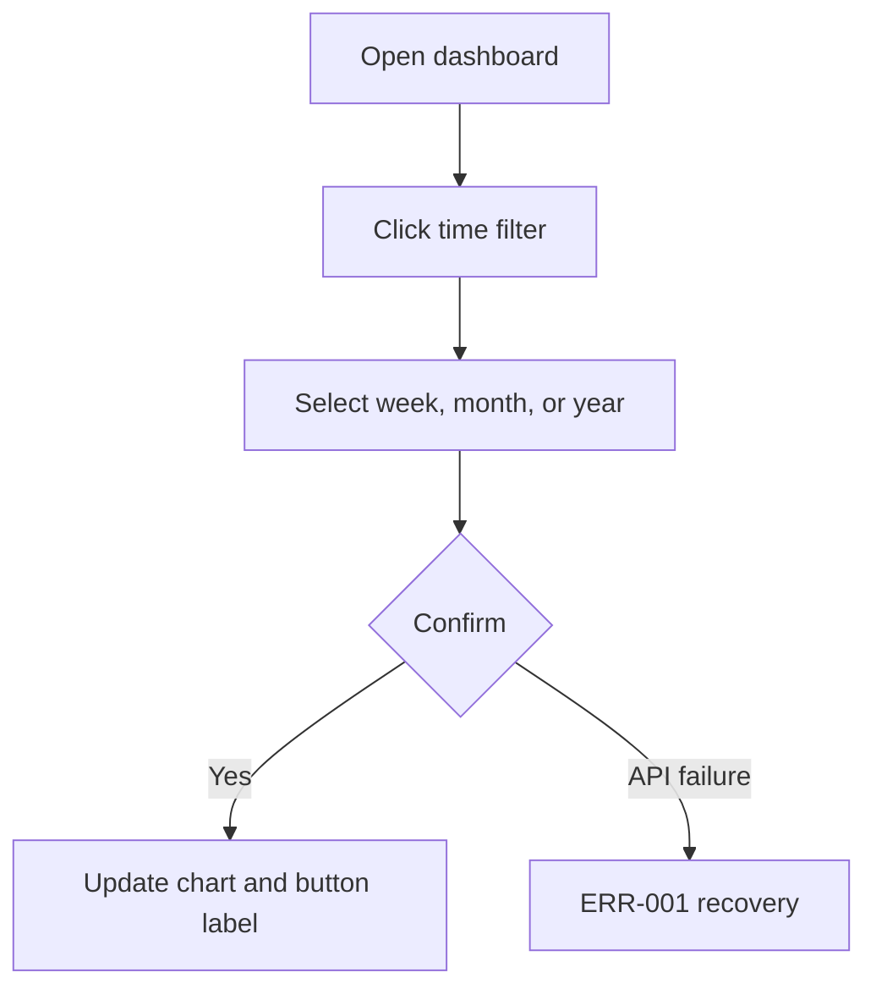

# PRD 範例：時間篩選功能

> 本範例為合成的儀表板時間篩選功能，作為 PRD 撰寫品質標準的參考。<!-- example -->

| Field | Value |
|-------|-------|
| Story ID | S-DASHBOARD-001 |
| Version | v1.0.0 |
| Status | Draft |
| Sprint | Sprint 5 |
| has_ui | true |
| Tickets | N/A |

---

## 1. Follow-ups

無 Blocking FU。Non-blocking FU: N/A。

---

## 2. Context

### Goal

營運人員需要查看不同時間範圍的使用數據。目前圖表固定顯示近期資料，分析比較需要人工查表，效率低且容易出錯。

### Persona + Pain

| Persona | Context | Pain point |
|---------|---------|------------|
| 營運人員 | 每週檢查儀表板趨勢 | 無法快速切換週/月/年範圍 |

### Success metrics

| Metric | Target | Measurement |
|--------|--------|-------------|
| 完成時間 | 篩選操作 10 秒內完成 | 使用者測試 |

### Risk and evidence

| Item | Trigger / Source | Mitigation / Decision |
|------|------------------|-----------------------|
| API 超時 | 使用者切換大範圍資料 | 保留上次圖表並顯示 ERR-001 |
| Evidence | 既有 dashboard filter component | 沿用既有 filter pattern |

---

## 3. Scope

### In scope

- 在圖表區塊加入週/月/年時間範圍選擇。
- 使用者確認後更新圖表資料與按鈕文字。
- 提供重置到預設週次的操作。

### Out of scope

- 自訂任意起訖日。
- 多圖表同步時間範圍。
- 圖表資料匯出。

---

## 4. Flow



---

## 5. Functional Requirements (FR)

### FR-001: 選擇圖表時間範圍

**使用者價值**: 營運人員能直接比較不同時間範圍的使用數據，不需要離開儀表板整理資料。

**Behavior**: 使用者可開啟時間選擇器，選擇週/月/年，確認後更新圖表資料與按鈕文字。

**Input**:

| Field | Required | Notes |
|-------|----------|-------|
| range_type | Yes | week / month / year |
| range_value | Yes | 選定的週、月份或年份 |

**Output**:

| Field | Notes |
|-------|-------|
| chart_data | 對應時間範圍的圖表資料 |
| filter_label | 按鈕顯示目前範圍 |

**Data source**: Existing dashboard metrics API

**Permissions / Visibility**: 可查看 dashboard 的使用者

**Boundary conditions**:

- 不可選擇未來時間範圍。
- API 回傳空陣列時顯示 Empty state，不視為錯誤。

---

## 6. Non-functional Requirements (NFR)

| Category | Requirement |
|----------|-------------|
| Performance | 篩選確認後 2 秒內顯示更新或錯誤狀態 |
| Security / Compliance | 沿用 dashboard 既有權限 |
| Accessibility | 鍵盤可操作，焦點停留在 Modal 內 |
| Compatibility | 支援目前 dashboard 支援的瀏覽器 |

---

## 7. Error Scenarios (ERR)

### ERR-001: 圖表資料載入失敗

**Trigger**: Metrics API 回傳 4xx、5xx 或逾時。

**Expected behavior**: 保留上次成功資料，顯示「資料載入失敗，請稍後再試」。

**Recovery**: 使用者可重試原範圍，或按重置回到預設週次。

---

## 8. Acceptance Criteria (AC)

### AC-001: 使用者更新時間範圍

```gherkin
Given 使用者已進入 dashboard 且圖表資料已載入
When 使用者開啟時間選擇器並選擇「月 / 2024-03」後確認
Then 圖表更新為 2024-03-01 到 2024-03-31 的使用數據
```

---

## 9. UI / UX

UI: 圖表右上角新增時間範圍按鈕，點擊後開啟選擇 Modal。

### Mockup evidence

- Existing component: dashboard filter modal pattern.

### Interaction and states

| State / Step | Expected behavior | Copy |
|--------------|-------------------|------|
| Default | 按鈕顯示目前時間範圍 | 最新週 |
| Loading | 確認後按鈕 disabled，圖表顯示 loading | 載入中 |
| Error | 保留上次資料並顯示錯誤訊息 | 資料載入失敗，請稍後再試 |
| Empty | 顯示空狀態，不回復舊資料 | 此範圍沒有使用數據 |

### Design tokens

| Token type | Usage |
|------------|-------|
| Color | 使用既有 dashboard button 與 modal token |
| Typography | 使用既有 form label token |
| Spacing | 使用既有 modal spacing token |

---

## 10. Dependencies & Constraints

- **Upstream**: Existing dashboard metrics API
- **Downstream**: Dashboard chart rendering
- **Breaking change**: No
- **Assumptions**: API 支援週/月/年查詢參數

---

## 11. Related Documents

| Document | Link |
|----------|------|
| Spec | N/A |
| QA Plan | N/A |
| Design | N/A |
| Ticket | N/A |

---

## 12. Gate 1 Check

- [x] Every FR has user value, data source, permissions, and boundary conditions.
- [x] Every AC uses Given-When-Then and has an executable precondition.
- [x] ERR covers the main failure and recovery path.
- [x] Scope, dependencies, breaking change, and assumptions are explicit.
- [x] Blocking FU is closed; non-blocking FU has owner and close-by point.
- [x] NFR has measurable target or N/A + reason.
- [x] UI evidence matches `has_ui`.
- [x] `prd-interview/references/gate-1.md` result is PASS.
