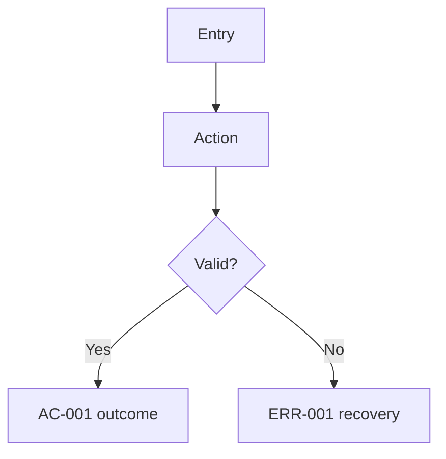

# PRD Field Guide

Use this guide only when a PRD field needs judgment. Keep the PRD itself short; record the decision, not the whole reasoning trail.

## Follow-ups

- Use `Blocking` when the answer can change scope, data shape, permissions, acceptance, or error behavior.
- Use `Non-blocking` when the answer can be settled after `spec` without changing the core contract.
- A Blocking FU must close before `spec`; a Non-blocking FU needs an owner and close-by point.
- Prefer two concrete options plus an AI recommendation. Do not leave an open-ended question as the only content.

## Flow

Fill the Flow section when the feature has navigation, a multi-step action, branching, or recovery behavior. Use `Flow: N/A, because ...` only for single-step or display-only work.

Good flow evidence is short:

The Flow section is a semantic contract. Downstream skills should find it by heading name, not by a fixed section number.

## Acceptance Criteria

- Use Given-When-Then for each AC.
- `Given` names an executable precondition: role, data, page, auth state, or system state.
- `When` names one user or system action.
- `Then` names an observable result that QA can test.
- Keep one behavior per AC. Add another AC only when it proves a different behavior.

## UI evidence

When manifest `has_ui: false`, write `UI: N/A (has_ui=false)` and mark UI evidence as N/A.

When `has_ui: true`, include only evidence that affects implementation or QA:

- `Mockup evidence`: Figma, screenshot, wireframe, existing component path, or `N/A + reason`.
- `Interaction and states`: default plus only applicable loading, error, empty, success, disabled, or responsive states.
- `Design tokens`: existing token names for color, typography, and spacing; if no UI change, write `N/A + reason`.
- Microcopy belongs only when it affects user decision, error recovery, or acceptance.

## External evidence

Search externally only for a new domain, unfamiliar UI pattern, external API/library, security concern, or performance risk. For ordinary repo-local work, record `Skipped: repo evidence sufficient` with the relevant project path or precedent.

## Length

Prefer one real example over repeated placeholders. The PRD template should contain one FR, one ERR, and one AC shape; actual PRDs add more only when the product behavior requires it.
