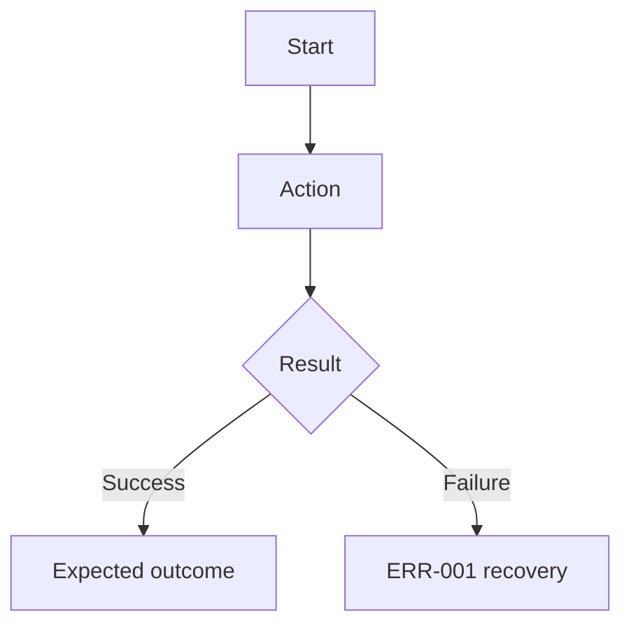

<!-- Canonical PRD shape. Single source of truth for both `to-prd` and
`prd-interview`; do not fork this into a skill-local copy. `scripts/check-prd.py`
enforces the machine-checkable subset of this shape and derives its
placeholder set from this file, so keep placeholders in `[square brackets]`.

Tier markers are authoring guidance for which sections a producer should populate:
  core  — the connectable minimum used by optional to-prd for personal/refactor
          work and reused by team-sprint prd-interview.
  team  — additionally expected from the formal team-sprint prd-interview handoff.
`scripts/check-prd.py` enforces a machine-checkable REQUIRED subset per tier (not
every marked section); a `core` PRD may omit `team` sections entirely but must not
leave placeholders unfilled. Headings are matched by name, not by number. -->

# [功能名稱] PRD

<!-- tier: team -->

| Field | Value |
|-------|-------|
| Story ID | S-[AREA]-[NN] |
| Version | v1.0.0 |
| Status | Draft |
| Sprint | Sprint [N] / N/A |
| has_ui | true / false |
| Tickets | [#issue] / N/A |

---

## 1. Follow-ups

<!-- tier: core -->

Blocking FU must be closed before `spec`. Non-blocking FU needs an owner and close-by point.
When there is nothing open, state it explicitly (for example `無 Blocking FU。Non-blocking FU: N/A。`).

### FU-001: [decision title]

| Type | Background | Options | AI recommendation | Decision |
|------|------------|---------|-------------------|----------|
| Blocking / Non-blocking | [why this changes scope, behavior, or acceptance] | A: [option A] / B: [option B] | [option + reason] | Pending / Confirmed: [decision] |

---

## 2. Context

<!-- tier: core -->

### Goal

[One paragraph: problem, beneficiary, and intended outcome.]

### Persona + Pain

<!-- tier: team -->

| Persona | Context | Pain point |
|---------|---------|------------|
| [role] | [work situation] | [current problem] |

### Success metrics

<!-- tier: team -->

| Metric | Target | Measurement |
|--------|--------|-------------|
| [metric] | [target value] | [how to observe it] |

### Risk and evidence

| Item | Trigger / Source | Mitigation / Decision |
|------|------------------|-----------------------|
| [real risk] | [when it happens] | [how to prevent or recover] |
| Evidence | [repo path, user statement, external source, or Skipped reason] | [adopted decision] |

---

## 3. Scope

<!-- tier: core -->

### In scope

- [behavior, workflow, or deliverable included in this PRD]

### Out of scope

- [behavior, workflow, or deliverable explicitly excluded]

---

## 4. Flow

<!-- tier: core -->

Flow: N/A, because [reason] / [short user or system flow]



---

## 5. Functional Requirements (FR)

<!-- tier: core -->

### FR-001: [requirement name]

**使用者價值**: [why this matters to the user or business]

**Behavior**: [what the system does]

**Input**:

<!-- tier: team -->

| Field | Required | Notes |
|-------|----------|-------|
| [field] | Yes / No | [meaning, constraint, or N/A] |

**Output**:

<!-- tier: team -->

| Field | Notes |
|-------|-------|
| [field] | [observable result] |

**Data source**: Existing [system/API] / New [owner] / FU-[ID]

**Permissions / Visibility**: [roles]

**Boundary conditions**:

- [edge case or invariant]

---

## 6. Non-functional Requirements (NFR)

<!-- tier: team -->

| Category | Requirement |
|----------|-------------|
| Performance | [target or N/A + reason] |
| Security / Compliance | [requirement or N/A + reason] |
| Accessibility | [requirement or N/A + reason] |
| Compatibility | [browser, device, API, or N/A + reason] |

---

## 7. Error Scenarios (ERR)

<!-- tier: core -->

### ERR-001: [error name]

**Trigger**: [condition]

**Expected behavior**: [system response]

**Recovery**: [user or system recovery path]

---

## 8. Acceptance Criteria (AC)

<!-- tier: core -->

### AC-001: [acceptance title]

```gherkin
Given [executable precondition]
When [user or system action]
Then [observable result]
```

---

## 9. UI / UX

<!-- tier: core -->

UI: N/A (has_ui=false) / [summary of changed UI]

### Mockup evidence

<!-- tier: team -->

- [Figma, screenshot, wireframe, existing component path, or N/A + reason]

### Interaction and states

<!-- tier: team -->

| State / Step | Expected behavior | Copy |
|--------------|-------------------|------|
| Default | [what user sees first] | [user-facing text or N/A] |
| Loading | [loading behavior or N/A + reason] | [copy or N/A] |
| Error | [error behavior or N/A + reason] | [copy or N/A] |
| Empty | [empty behavior or N/A + reason] | [copy or N/A] |

### Design tokens

<!-- tier: team -->

| Token type | Usage |
|------------|-------|
| Color | [existing token name or N/A + reason] |
| Typography | [existing token name or N/A + reason] |
| Spacing | [existing token name or N/A + reason] |

---

## 10. Dependencies & Constraints

<!-- tier: core -->

- **Upstream**: [PRD, system, external team, or N/A]
- **Downstream**: [affected features, reports, users, or N/A]
- **Breaking change**: Yes ([impact]) / No
- **Assumptions**: [unverified premise] / N/A

---

## 11. Related Documents

<!-- tier: team -->

| Document | Link |
|----------|------|
| Spec | `<spec-artifact-path>` / N/A |
| QA Plan | `<qa-artifact-path>` / N/A |
| Design | [link] / N/A |
| Ticket | [#issue] / N/A |

---

## 12. Gate 1 Check

<!-- tier: core -->

- [ ] Every FR has user value, data source, permissions, and boundary conditions.
- [ ] Every AC uses Given-When-Then and has an executable precondition.
- [ ] ERR covers the main failure and recovery path.
- [ ] Scope, dependencies, breaking change, and assumptions are explicit.
- [ ] Blocking FU is closed; non-blocking FU has owner and close-by point.
- [ ] NFR has measurable target or N/A + reason.
- [ ] UI evidence matches `has_ui`.
- [ ] `scripts/check-prd.py` result is PASS.
