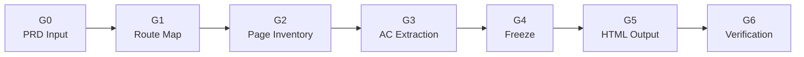

# Prototype

> 從 PRD 到可互動灰階 Prototype bundle。G1 / G4 / G6 是三個人工 Gate；G2 / G3 是 AI 內部處理，不向人停等。

---

## Gate 流程總覽



> 人工確認只在 G1、G4、G6。G2/G3 可以重算，但不得額外詢問；需要人的衝突集中放入下一個 Gate Package。

---

## Gate 摘要表

| Gate | 名稱 | Input | Output | 人工確認 |
|------|------|-------|--------|:-------:|
| G0 | PRD Input | PRD 文件 + manifest | PRD 摘要 + meta 初稿 + PRD AC Master List（落檔） | — |
| G1 | Route Map | PRD 摘要 | `map.routes{}` + Scenario 概覽表 |  |
| G2 | Page Inventory | routes + component-library | `map.pages{}` + 積木選配清單 | — |
| G3 | AC Extraction | pages + PRD | `pages[].acs[]` + AC 覆蓋預覽 | — |
| G4 | Freeze | G1~G3 累積 map + PRD AC Master List | `prototype-map-v{N}.json` + Gap Report |  |
| G5 | HTML Output | frozen map + templates + component-library | `<work_root>/<slug>/prototype/index.html` | — |
| G6 | Verification | HTML + frozen map + Gap Report | script 報告 + human click walkthrough |  |

---

G1、G4、G6 都使用 [`../GATE-PACKAGE.md`](../GATE-PACKAGE.md)。呈現決策時把 prototype stage 設為 `awaiting-approval`；收到具體決定後改為 `approved`。G2/G3 只更新內部產物，不改成人工等待狀態。

---

## Manifest 路徑解析

AI 必須先讀取 `.agent/project-manifest.md` 中的 `Prototype Config` 區塊：

```markdown
## Prototype Config
- `component_library`: path/to/component-library.html
- `prototype_input`: path/to/input/{project}/
- `prototype_sitemap`: path/to/sitemap.json   # 可選，有則 G2 優先採信
```

- 輸入與 sitemap 路徑從 manifest 讀取；輸出固定遵循 [`../ARTIFACTS.md`](../ARTIFACTS.md)
- 若缺少 `Prototype Config`，回報缺什麼欄位，不猜測

---

## Hybrid Frame 複用規則

G5 產出 HTML 時，依 frame 差異量選擇複用策略：

1. **差異 ≤ 3 且無條件分支** → `<template>` + clone function（Option A）
2. **差異 > 3 或有條件分支** → FRAME_REGISTRY render function（Option C）
3. **僅出現一次** → FRAME_REGISTRY render function（保持一致性）

→ 詳見 `references/frame-reuse-spec.md`

---

## G5 架構規則

### CSS 載入：一律 `<link>` 引用，禁止 inline

Shell CSS 從 `templates/` 直接 `cp` 複製到 output 目錄，HTML 用 `<link>` 引用。
`component_library` 若是 HTML，G5 必須抽出 library 內的 `<style>` 並產出 `assets/component-library.css`；若本身已是 CSS 資產，則直接複製到相同檔名。
AI **不輸出 CSS 內容**，節省 ~85% output token。

### Engine.js：READONLY，AI 不得修改

`templates/engine.js` 包含所有 runtime JS（導航、AC checklist、匯出報告等）。
從 `templates/` 直接 `cp` 複製到 output 目錄，AI **不輸出也不修改 engine 函式**。

### AI 只需填入 3 個區塊

| 區塊 | 內容 | AI 判斷量 |
|------|------|:--------:|
| NAV_HTML | 左欄 `<li>` 列表 | 零 |
| PANELS_HTML | 右欄 scenario panel 容器 | 零 |
| DATA_JS | 資料變數 + FRAME_REGISTRY | 低 |

---

## PRD 變更管理

PRD 修改時依時間點決定重入策略：

| 時間點 | 策略 |
|--------|------|
| G0~G3（未凍結） | 差異比對 → 從最早受影響 gate 向下瀑布重跑 |
| G4 已凍結、G5 未完成 | PRD Diff 分析 → 解凍重入 → 新版本 v{N+1} |
| G5~G6 已完成 | PRD Diff + HTML 影響評估 → Patch 或 Rebuild |

→ 詳見 `references/gates/G4-freeze.md`

---

## Gate 詳細規格載入指引

執行各 Gate 時，按需讀取對應規格文件：

| Gate | 規格文件 |
|------|----------|
| G0 | → 見 `references/gates/G0-prd-input.md` |
| G1 | → 見 `references/gates/G1-route-map.md` |
| G2 | → 見 `references/gates/G2-page-inventory.md` |
| G3 | → 見 `references/gates/G3-ac-extraction.md` |
| G4 | → 見 `references/gates/G4-freeze.md` |
| G5 | → 見 `references/gates/G5-html-output.md` + `references/frame-reuse-spec.md` |
| G6 | → 見 `references/gates/G6-verification.md` |

資料結構定義 → 見 `references/prototype-map-schema.md`

---

## 相關資源

| 資源 | 路徑 | 備註 |
|------|------|------|
| CSS 共用樣式 | `templates/shell-common.css` | 複製到 output |
| Standard Shell CSS | `templates/shell-standard.css` | 複製到 output |
| Flow Shell CSS | `templates/shell-flow.css` | 複製到 output |
| Component Library CSS | `{component_library}` → `assets/component-library.css` | G5 抽取或複製 |
| 列印樣式 | `templates/print-report.css` | 複製到 output |
| JS 引擎 | `templates/engine.js` | READONLY，複製到 output |
| 共用 scaffold | `templates/scaffold-standard.html` | standard/flow 共用，複製到 output → AI 填入 |
| Map 驗證腳本 | `scripts/validate-map.sh` | |
| Freeze 比對腳本 | `scripts/verify-freeze.py` | G6 機械檢查 |


---

## 微調模式（Tuning）

已產出 prototype HTML 後，若只需小範圍視覺/互動修正（太寬/沒對齊/間距/單一 frame），用最小變更修正、不誤傷全域模板。

- 互動入口與流程：[`references/tuning.md`](references/tuning.md)
- 可填需求模板：[`templates/ui-request-template.md`](templates/ui-request-template.md)

**產出落檔**（ADR-006）：`<work_root>/<slug>/prototype/index.html`，並更新工作項根目錄的 `meta.yml`。

G6 先執行 `verify-freeze.py`；只有 script PASS 才交給使用者做 click walkthrough。人只判斷互動流程、理解成本與體驗，不逐項人工比對 JSON、AC、frame 或 assets。
